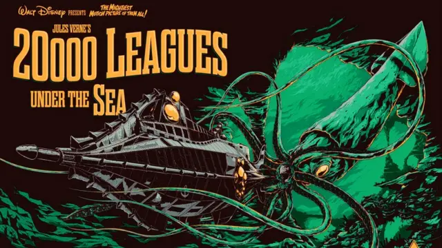

# Virtual Nautilus

<h3>My Stack</h3>
<svg height="32" width="32" xmlns="http://www.w3.org/2000/svg" viewBox="0 0 512 512">
  <path fill="#3178C6" d="M470.6 105.4c12.5 12.5 12.5 32.8 0 45.3l-256 256c-12.5 12.5-32.8 12.5-45.3 0l-128-128c-12.5-12.5-12.5-32.8 0-45.3s32.8-12.5 45.3 0L192 338.7 425.4 105.4c12.5-12.5 32.8-12.5 45.3 0z"/>
</svg>
<em>TypeScript</em>
- React developer
- Nodejs and Golang passionate
- Bug hunter
- Get deep for troubleshooting, just like a virtual Nautilus would do
